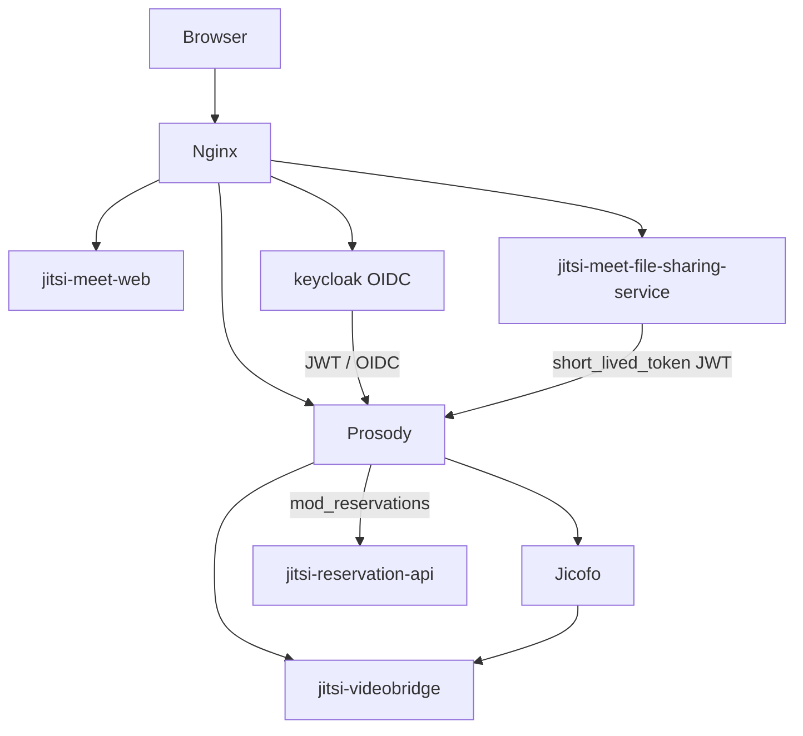

# План: Jitsi Meet RPM (Fedora 44 + EL9), нативно без Docker

## Цель

Собрать полный стек Jitsi Meet в RPM на Fedora 44, установка на **Fedora 44** и **RHEL/Rocky/Alma 9**. Все сервисы — systemd, без Docker.

## Расширенный состав (фаза 1 + auth + files + reservations)

| RPM | Источник | Назначение |
|-----|----------|------------|
| `jicofo` | jitsi/jicofo | Conference focus |
| `jitsi-videobridge` | jitsi/jitsi-videobridge | SFU / медиа |
| `jitsi-meet-web` | jitsi/jitsi-meet | Web UI (статика) |
| `jitsi-meet-prosody` | jitsi/jitsi-meet `resources/prosody-plugins/` | Lua-плагины Prosody + шаблон cfg |
| `jitsi-meet-web-config` | jitsi/jitsi-meet `debian/` | nginx, config.js, TLS hooks |
| `jitsi-meet-file-sharing-service` | jitsi/jitsi-meet-file-sharing-service | REST API загрузки файлов |
| `jitsi-reservation-api` | grommunio/jitsi-reservation-api | REST API бронирования комнат |
| `keycloak` | keycloak.org tarball | OIDC / SSO (нативный Quarkus) |
| `jitsi-meet-auth-keycloak` | локальные шаблоны | Prosody token + config.js + nginx для Keycloak |
| `jitsi` | метапакет | Весь стек single-server |

**Не из RPM Jitsi:** `prosody`, `nginx`, `postgresql`, `java-*-openjdk-headless` — из Fedora/EPEL.

## Архитектура



## 1. File sharing (отправка файлов)

Официальный компонент: [jitsi-meet-file-sharing-service](https://github.com/jitsi/jitsi-meet-file-sharing-service) + Prosody `short_lived_token` + плагин `mod_filesharing_component.lua` из jitsi-meet.

### RPM `jitsi-meet-file-sharing-service`

- **Сборка:** Node.js >= 22, `npm ci && npm run build`
- **Runtime:** systemd (не pm2), порт `127.0.0.1:3000`
- **Файлы:**
  - `/usr/lib/jitsi-meet-file-sharing-service/` — приложение
  - `/etc/jitsi/file-sharing-service/env` — `JWT_PUBLIC_KEY_PATH`, `UPLOAD_DIR`
  - `/var/lib/jitsi/file-sharing/uploads/` — хранилище
  - `/etc/jitsi/file-sharing-service/short_lived_token.{key,pub,pem}` — ключи (генерирует `%post` или `jitsi-meet-configure`)
- **Зависимости:** `nodejs`, группа `prosody` на ключ

### В `jitsi-meet-prosody`

- Установить `mod_filesharing_component.lua`, `mod_short_lived_token.lua`
- Шаблон cfg: блок `short_lived_token`, `jitsi_default_permissions['file-upload'] = true`

### В `jitsi-meet-web-config`

- nginx `location ^~ /file-service/` → proxy на `:3000`
- `config.js`: `config.fileSharing = { apiUrl: 'https://FQDN/file-service/v1/documents', enabled: true }`
- `client_max_body_size 50M`

Документация: [File sharing handbook](https://jitsi.github.io/handbook/docs/devops-guide/file-sharing/)

## 2. Keycloak (авторизация, нативно)

Официальный handbook для Jitsi + Keycloak: [Authentication](https://jitsi.github.io/handbook/docs/devops-guide/authentication/). Upstream пример — Docker; у нас **tarball + systemd**.

### RPM `keycloak`

- **Источник:** `https://github.com/keycloak/keycloak/releases/download/VERSION/keycloak-VERSION.tar.gz`
- **Установка:** `/opt/keycloak`, пользователь `keycloak`
- **Build step:** `kc.sh build` при сборке RPM (Quarkus optimized)
- **Runtime:** `kc.sh start --optimized`, за reverse proxy (nginx)
- **БД:** PostgreSQL (отдельный пакет `postgresql-server`, не бандлить)
- **Конфиг:** `/etc/keycloak/keycloak.conf` (hostname, db, proxy=edge)

Примечание: официального RPM Keycloak больше нет (Quarkus); только обёртка над tarball.

### RPM `jitsi-meet-auth-keycloak`

Шаблоны конфигурации (подставляется FQDN скриптом `jitsi-meet-configure`):

**Prosody** (`VirtualHost "meet.example.com"`):
- `authentication = "token"`
- `asap_accepted_issuers`, `cache_keys_url` → Keycloak realm certs
- `VirtualHost "guest.meet.example.com"` — anonymous guests
- `muc_wait_for_host`, `persistent_lobby`

**config.js:**
- `anonymousdomain`, `tokenAuthUrl`, `tokenLogoutUrl`, `tokenAuthInline`, `sso`

**nginx:**
- `location ~ ^/realms/` → Keycloak backend
- Redirect URIs: `/static/sso.html`, `/static/logout.html`

JWT для file-upload: в Keycloak mapper / token claim `context.features.file-upload = true`.

## 3. Reservation system

Jitsi **не поставляет** сервер бронирования — только Prosody-модуль `mod_reservations.lua`, который дергает внешний REST API.

### Клиентская часть (в `jitsi-meet-prosody`)

```lua
modules_enabled = { ..., "reservations"; }
reservations_api_prefix = "http://127.0.0.1:8088"
reservations_api_headers = { ["Authorization"] = "Bearer TOKEN"; }
```

Опционально: `reservations_enable_max_occupants`, `reservations_enable_lobby_support`, `reservations_enable_password_support`.

Документация: [Reservation System](https://jitsi.github.io/handbook/docs/devops-guide/reservation/)

API контракт (Prosody → backend):
- `POST /conference` — создать/разрешить комнату (`name`, `start_time`, `mail_owner`)
- `GET /conference/{id}` — конфликт 409
- `DELETE /conference/{id}` — освободить комнату

### RPM `jitsi-reservation-api`

- **Источник:** [grommunio/jitsi-reservation-api](https://github.com/grommunio/jitsi-reservation-api) (Python Flask + SQLite)
- **Альтернатива:** свой сервис; контракт фиксирован handbook
- **Runtime:** systemd + gunicorn/uwsgi, порт `8088`
- **Файлы:** `/etc/jitsi-reservation-api/config.py`, `/var/lib/jitsi-reservation-api/reservations.db`
- **Интеграция с Keycloak:** `mail_owner` из JWT Prosody; API может требовать предварительное бронирование через `POST /reservation` (CRUD grommunio)

С Keycloak: без auth `mail_owner` пустой — бронирование по пользователю не работает; **Keycloak обязателен** для полноценного reservation flow.

## 4. Клонирование (обновлённый список)

```bash
./scripts/clone-sources.sh
```

| Репозиторий | Ветка |
|-------------|-------|
| jitsi/jitsi-meet | `stable/jitsi-meet_11146` |
| jitsi/jicofo | тот же тег |
| jitsi/jitsi-videobridge | тот же тег |
| jitsi/jitsi-meet-file-sharing-service | `master` (пока без stable-тега) |
| grommunio/jitsi-reservation-api | `master` |

Keycloak — tarball при сборке RPM, не git.

## 5. Порядок сборки RPM

1. `jitsi-videobridge`, `jicofo` (Maven, JDK 21)
2. `jitsi-meet-web` (Node 22, `make`)
3. `jitsi-meet-prosody`, `jitsi-meet-web-config`
4. `jitsi-meet-file-sharing-service` (Node 22)
5. `jitsi-reservation-api` (Python)
6. `keycloak` (tarball + `kc.sh build`)
7. `jitsi-meet-auth-keycloak` (noarch templates)
8. `jitsi` (метапакет)

Mock targets: `fedora-44-x86_64`, `rocky+epel-9-x86_64`.

## 6. Установка на сервере (native)

```bash
# База + стек
sudo dnf install postgresql-server nginx prosody java-21-openjdk-headless
sudo postgresql-setup --initdb && sudo systemctl enable --now postgresql

sudo dnf install jitsi jitsi-meet-auth-keycloak keycloak jitsi-reservation-api

# Однократная настройка (FQDN, секреты, Keycloak realm, reservation token)
sudo jitsi-meet-configure --domain meet.example.com \
  --keycloak-admin-password '...' \
  --reservation-api-token '...'

sudo systemctl enable --now keycloak jitsi-reservation-api \
  jitsi-meet-file-sharing-service prosody jicofo jitsi-videobridge nginx
```

## 7. Риски

| Риск | Митигация |
|------|-----------|
| Keycloak без RPM upstream | Обёртка tarball + `%post` kc.sh build |
| File sharing — pm2 в handbook | systemd unit в нашем RPM |
| Reservation API — сторонний проект | grommunio, Python 3.9+ на EL9 |
| Lua-модули Prosody на EL9 | Доп. RPM из luarocks при отсутствии в EPEL |
| Версии web/jicofo/jvb | один stable-тег `jitsi-meet_11146` |

## 8. Чеклист реализации в этом репозитории

- [x] Базовые spec: jicofo, jitsi-videobridge, jitsi-meet-web, jitsi
- [ ] jitsi-meet-prosody (+ reservations, filesharing, short_lived_token)
- [ ] jitsi-meet-web-config (+ nginx keycloak + file-service)
- [ ] jitsi-meet-file-sharing-service
- [ ] jitsi-reservation-api
- [ ] keycloak (tarball wrapper)
- [ ] jitsi-meet-auth-keycloak
- [ ] `jitsi-meet-configure` (замена debconf)
- [ ] Обновить метапакет `jitsi`
- [ ] mock build для FC44 + EL9
